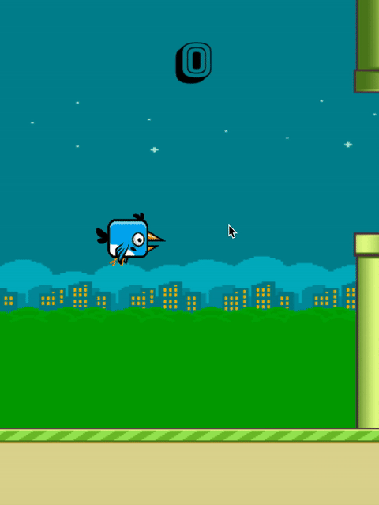

# flappy-bird
Clone of the Addictive Game Flappy Bird. Used JavaScript, Canvas and HTML5

# Live Site
https://lailahasnain.github.io/flappy-bird/

# Background
- Animate the bird and background by utilizing sprite sheet on HTML5 canvas for dynamic and smooth rendering
- Simulate collision detection with platform rendering that efficiently updates game state

# Architecture and Technologies 
- Vanilla Javascript for overall structure and create an interactive game
- HTML5 Canvas to render game components (bird, background, pipes)
- Webpack to bundle scripts into a single source

